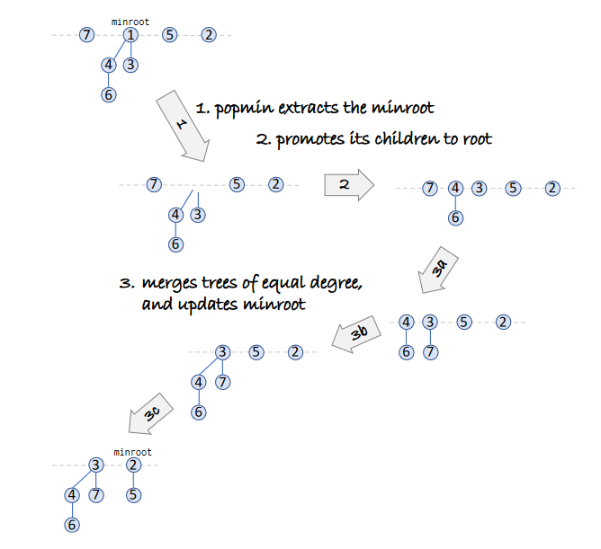

# Fibonacci Heap
- The fibonacci heap is a collection of multiple heaps where the root nodes are stored
- The biggest difference between and fibinacci heap and a binary heap is that we are "lazy" with pushes and 
only cleanup in batches (as opposed to every pop with binary heaps)
- It is called the fibonacci heap because each tree of order n has to have at least Fn+2 nodes in it
- It is an smart implementation of a priority queue with clever amoratised algorithm design. 
<br></br>


<br></br>

## Push
- We are lazy with pushes and simply add new nodes as a root node
<br></br>


<br></br>

```python
def push(key):
    # create new-node with key
    # add new-node to list of roots
    # update min-root if min-root is None or new-node.val < min-root.val
```

## Pop
- Pop the min root reference, promote orphans as new root nodes
- clean our heaps by merging root nodes with the same "rank" or "degree"
    - rank/degree signifies the amount of children.
    - all root nodes with the dame degree are merged to maintain O(log N) degrees at most.
    - This is to maintain a degree K where K is at least FK+2, where FK is the Kth Fibonacci number.

<br></br>



<br></br>

```python
def pop():
    # take reference of min-root.val
    # delete min-root, promote orphans to roots
    # clean the roots by merging
    while there are two roots with same degree:
        merge(root1, root2)  # maintain heap property while doing so
    update min-root pointer
    return val
```

## Replace
- replace old val with new val
- check for heap violation
- if there is a heap violation, splice the replace node and promote to root node
- special rules with the splicing:
    - Here we must maintain the size of the heap by mainting degrees.
    - if a node loses a child, it is marked as a loser. Double losers (nodes that have lost all of their losers) will be promoted to root.
    - All nodes promoted to root are marked as non-losers.
    - this is to avoid shallow & wide trees. Why this needs to be done will become more apparent in the amoritised analysis.
    the amoritised algorithm analysis. 

<br></br>


<br></br>


<br></br>

```python
def replace(old_val, new_val):
    # find node with old val
    # replace val
    # check for heap violation
        # get parent of node
        # remove pointer of node from parent
        # insert node as root and mark it as non loser
    # check for double losers with parents, all double losers are to be promoted to root
```


# Potential Function & complexity for data structures
- Push - O(1)
- Pop - O(log N)
- Replace - O(1)

<br></br>


<br></br>

- There are several methods to caclulate amortised complexity analysis. Aggregate, accounting, charging & potential methods. I will be using the potential method because it is the most powerful.

- Note on amoritised bounds:
    - assign an amorised cost for each operation such that you "preserve the sum" of those costs
    - the sum of amoritised costs of all operations should be >= actual costs of all operations. Sum of amoritised costs should be the upper bound.
    - We generally only care about the aggregate of the actual costs.

## Potential Function
- A potential function is a measure of its performance over sequences of operations that smooths out the cost of infrequent but expensive [operations](https://en.wikipedia.org/wiki/Potential_method). This function Φ is equivalent to the total unused credits stored up by all past operations:
    - amoritised cost of an operation = actual cost + ΔΦ 
    - sum(amoritised cost) = sum(actual cost + Φ(final data structure) - Φ(start data structure))
    - The output of a potential function can never be negative because we are not allowed to "owe" the bank
- It measures how "bad" a data structure is. 
- When coming up with a potential function, it is not strictly defined and is arbitrary. Potential functions are formulated with some insight on the data structure.

## Potential function for fibonacci heaps
- The number of trees in the forest + twice the amount of marked nodes
- Φ = num_roots + 2 * num_losers

## Push complexity
- c = O(1) 
- ΔΦ = 1  # num_roots increases by 1
- c + ΔΦ => O(1)

## Replace complexity
- Case 1: no heap violation
    - c = O(1)
    - ΔΦ = 0  #  heap structure does not chance
    - c + ΔΦ = O(1)

- Case 2: heap violation
    1 - promote violdated node to root:
        - c = O(1)
        - ΔΦ = 1  #  new root node added
        - c + ΔΦ = O(1)
    2 - promote double losers
        - c = O(L)
        - ΔΦ = +L-2L = -L
        - c + ΔΦ = O(1)

## Pop complexity
- Note: this is why we pay attention to degrees for our fib heap, to make this operation be O(log N) we force a max number of children 

- Case 1: delete min root, promote children
    - `c = O(num_children)  # degree <= log N`
    - ΔΦ <= -1 + num_children  # remove parent, add children
    - c + ΔΦ = O(log N)

- Case 2: cleanup
    - suppose we start with X trees, do M merges & end up with Y trees.
    - c = O(X + M + log N)

- Case 3: find new min from cleaned roots (roots with equal degrees have been merged)
    - c = O(log N) #  max degree is log N

# Shape Theorem


# Resources
- Why its called a [fibonacci](https://stackoverflow.com/a/14333315/12454155) heap
- The [intuition & motivation](https://stackoverflow.com/a/19508527/12454155) behind the data structure
- Amoritised runtime analysis with the [potential function](https://www.youtube.com/watch?v=6_BBQWQ2HQQ)
- More about amortised analysis using a [potential function](https://ocw.mit.edu/courses/electrical-engineering-and-computer-science/6-046j-design-and-analysis-of-algorithms-spring-2015/lecture-notes/MIT6_046JS15_lec05.pdf) - Pages 4-6
- [More notes on fibocacci heaps (pages 62-72)](https://www.cl.cam.ac.uk/teaching/2021/Algorithms/notes2.pdf)