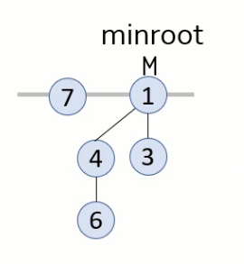
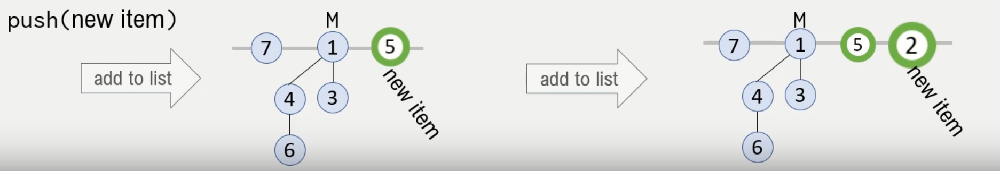
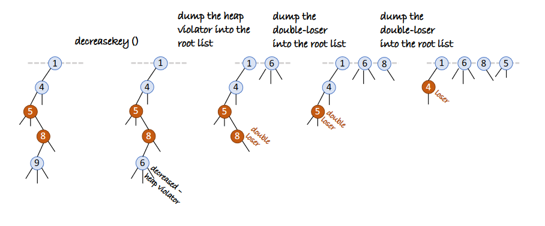
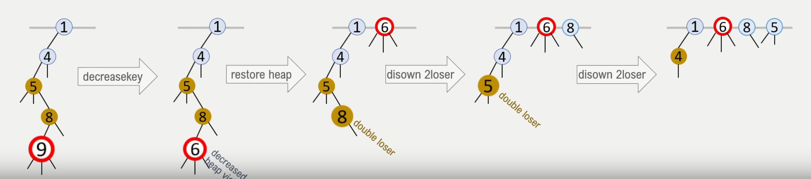
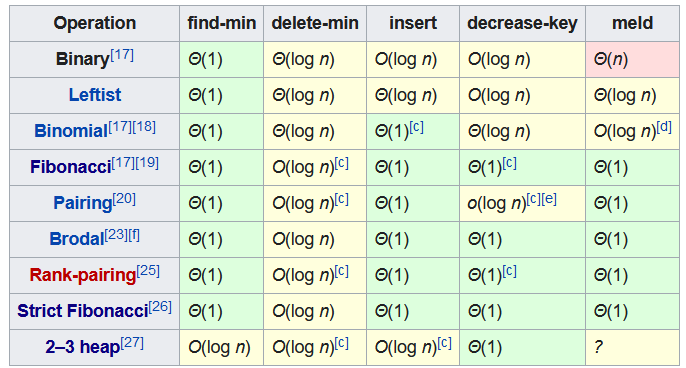

# Fibonacci Heap
- The fibonacci heap is a collection of multiple heaps where the root nodes are stored
- The biggest difference between and fibinacci heap and a binary heap is that we are "lazy" with pushes and 
only cleanup in batches (as opposed to every pop with binary heaps)
- It is called the fibonacci heap because each tree of order n has to have at least Fn+2 nodes in it
- It is an smart implementation of a priority queue with clever amoratised algorithm design. 
<br></br>


<br></br>

## Push
- We are lazy with pushes and simply add new nodes as a root node
<br></br>


<br></br>

```python
def push(key):
    # create new-node with key
    # add new-node to list of roots
    # update min-root if min-root is None or new-node.val < min-root.val
```

## Pop
- Pop the min root reference, promote orphans as new root nodes
- clean our heaps by merging root nodes with the same "rank" or "degree"
    - rank/degree signifies the amount of children.
    - all root nodes with the dame degree are merged to maintain O(log N) degrees at most.
    - This is to maintain a degree K where K is at least FK+2, where FK is the Kth Fibonacci number.

<br></br>

![3]](images/pop.png)

<br></br>

```python
def pop():
    # take reference of min-root.val
    # delete min-root, promote orphans to roots
    # clean the roots by merging
    while there are two roots with same degree:
        merge(root1, root2)  # maintain heap property while doing so
    update min-root pointer
    return val
```

## Replace
- replace old val with new val
- check for heap violation
- if there is a heap violation, splice the replace node and promote to root node
- special rules with the splicing:
    - Here we must maintain the size of the heap by mainting degrees.
    - if a node loses a child, it is marked as a loser. Double losers (nodes that have lost all of their losers) will be promoted to root.
    - All nodes promoted to root are marked as non-losers.
    - this is to avoid shallow & wide trees. Why this needs to be done will become more apparent in 
    the amoritised algorithm analysis. 

<br></br>



<br></br>



<br></br>

```python
def replace(old_val, new_val):
    # find node with old val
    # replace val
    # check for heap violation
        # get parent of node
        # remove pointer of node from parent
        # insert node as root and mark it as non loser
    # check for double losers with parents, all double losers are to be promoted to root
```


# Potential Function & Runtime
- Push - O(1)
- Pop - O(log N)
- Replace - O(1)

<br></br>




# Num losers
- 

# Resources
- Why its called a [fibonacci!](https://stackoverflow.com/a/14333315/12454155) heap
- The [intuition & motivation!](https://stackoverflow.com/a/19508527/12454155) behind the data structure
- Amoritised runtime analysis with the [potential function!](https://www.youtube.com/watch?v=6_BBQWQ2HQQ)
- [Notes (pages 62-72)](https://www.cl.cam.ac.uk/teaching/2021/Algorithms/notes2.pdf)